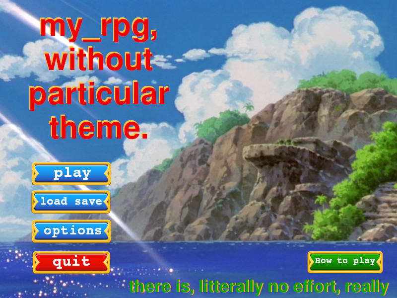
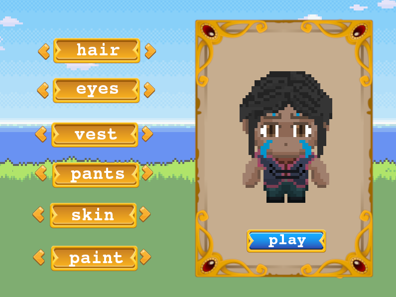
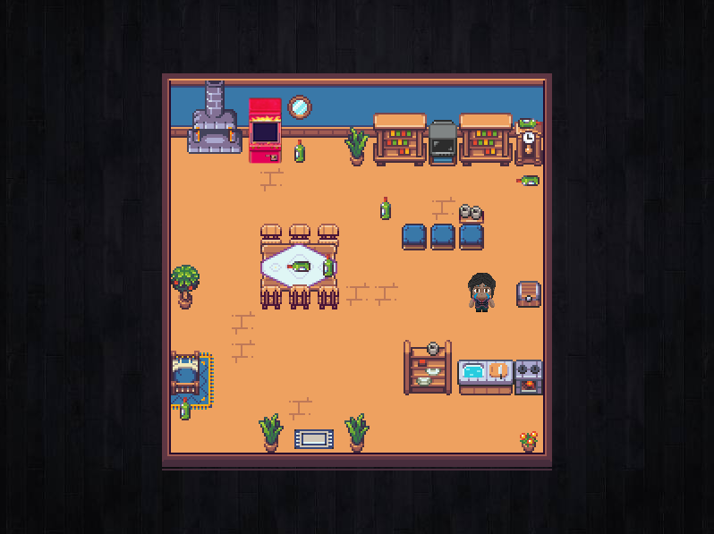
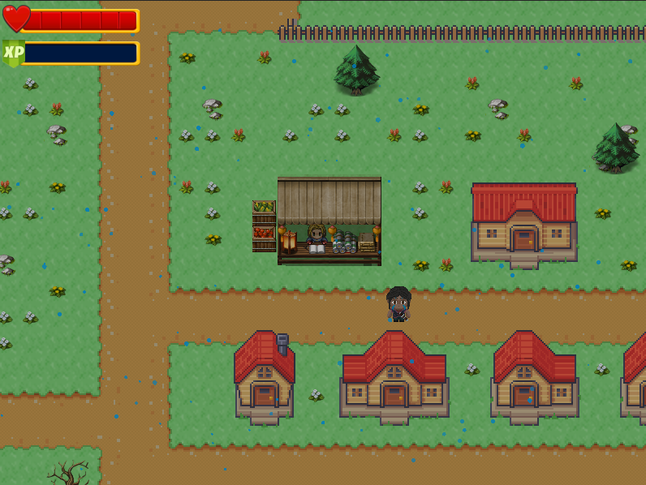
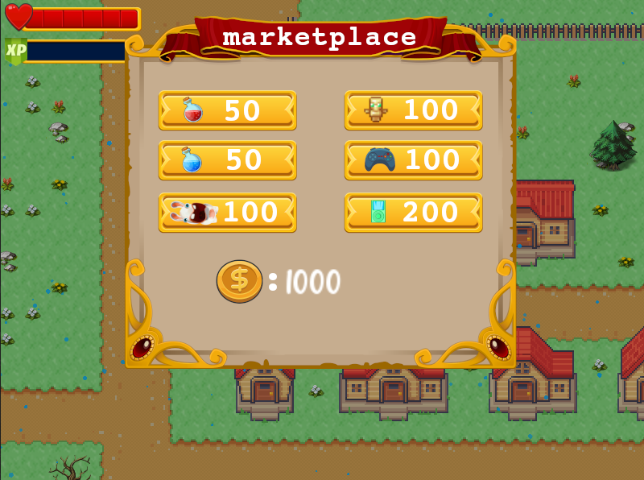
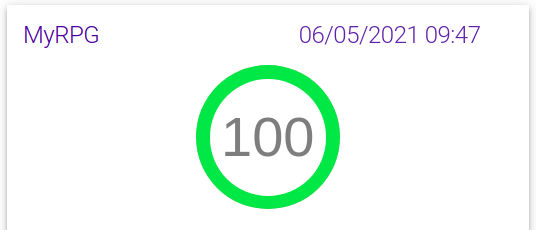

  

<h3 align="center">my_rpg</h3>

---

 Last Graphical Project of 1st year at Epitech
      

## What's my_RPG ?

 

The my_RPG is the final graphic project of the first year at Epitech, the goal of this project 
is to realise a RPG like, with a complete game, quest, and real fight management. We have liberty 
to add more functionnality like us. 

## Our bonus

 

We decide to add lot of add-on to complete our game and make the gameplay more realistic.  Principals bonus are: 

        - Dynamic Inventory System
        - Economy with a market
        - Particule Engine to make particules more realistic
        - Implement a bonus game on an arcade machine
        - Make a menu to custom our main character
        - Make a skill tree to upgrade our competencies

  
  
  
  

 

## To Finish

 

To close this module, we have to do a complete presentation of the project and explain how we do this project ! 
At the end of the presentation we get a first mark, and in a second time we do a technical review to expose our 
code and present all functionality of our game. In conclusion we get a grade from E to A for this module.

        Presentation mark:      4442

        Technical review mark:  240

        Grade:                  A

         
        We get the best marks of our Promotion.

 

## Credits

 

### **Thomy Lorenzatti** https://github.com/ThomyLorenzatti  
### **Mathis Lorenzo** https://github.com/ZaldieR  
### **Hugo Rodrigues** https://github.com/hugomagics  
### **Nathan Guiu** https://github.com/Nathn-G  
